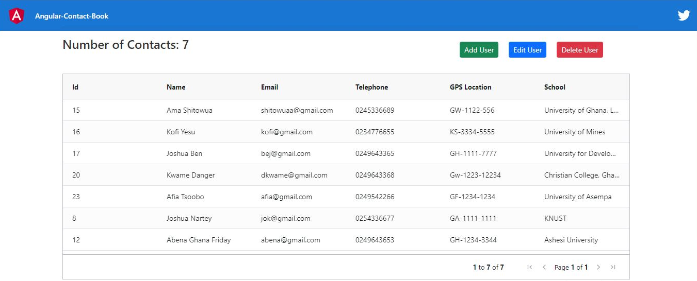
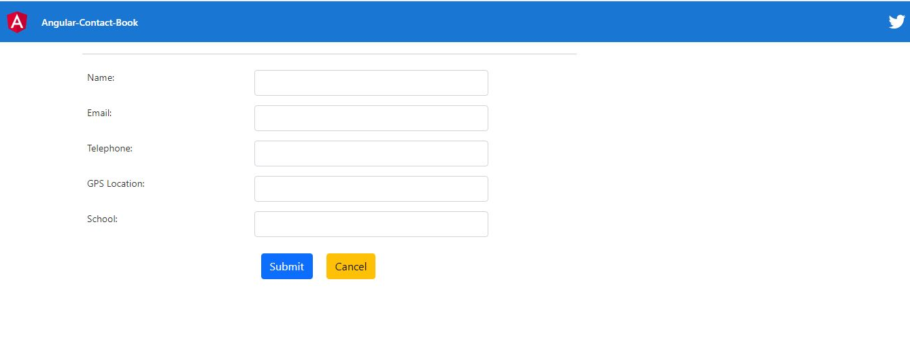
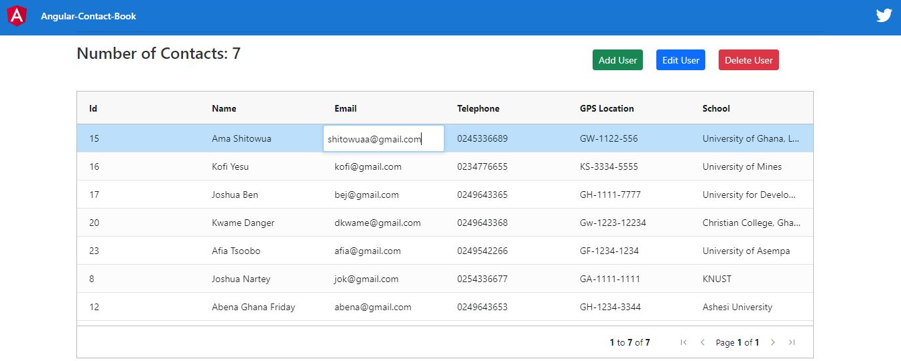
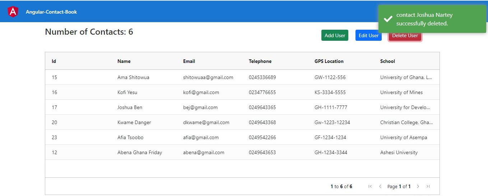

<!-- PROJECT LOGO -->
<br />
<p align="center">
  <a href="">
    
  </a>

  <h3 align="center">Contact Book App</h3>

  <p align="center">
The best way of learning is actually building something.
    <br />
    <br />
    <br />
    ·
    <a href="https://web.facebook.com/salvation.jnr/">Report Bug</a>
    ·
    <a href="https://web.facebook.com/salvation.jnr/">Request Feature</a>
  </p>
</p>


<!-- TABLE OF CONTENTS -->
<details open="open">
  <summary>Table of Contents</summary>
  <ol>
    <li>
      <a href="#about-the-project">About The Project</a>
      <ul>
        <li><a href="#built-with">Built With</a></li>
      </ul>
    </li>
    <li>
      <a href="#getting-started">Getting Started</a>
      <ul>
        <li><a href="#prerequisites">Prerequisites</a></li>
        <li><a href="#installation">Installation</a></li>
      </ul>
    </li>
    <li><a href="#usage">Usage</a></li>
    <li><a href="#contact">Contact</a></li>
  </ol>
</details>


<!-- ABOUT THE PROJECT -->
## About The Project


This project a simple CRUD app build with python flask and Angular to demonstrate how modern web app are built using API and HTTP request. With this app, you can add a contact to the app, read all contact, update a particular contact and delete a particular contact. 

### Built With

 
  * [Python](https://docs.python.org/3.6/)
  * [Virtualenv](https://docs.python.org/3/library/venv.html)
  * [Flask](https://flask.palletsprojects.com/en/2.0.x/)
  * [Flask SQLAlchemy](https://flask-sqlalchemy.palletsprojects.com/en/2.x/)
  * [Flask Migrate](https://flask-migrate.readthedocs.io/en/latest/)
  * [Python Requests](https://docs.python-requests.org/en/master/)
  * [Javascript](https://developer.mozilla.org/en-US/docs/Web/JavaScript)
  * [Angular](https://angular.io/docs)
  * [Bootstrap](https://medium.com/codingthesmartway-com-blog/using-bootstrap-with-angular-c83c3cee3f4a)
  * [HTML](https://devdocs.io/html/)
  * [CSS](https://devdocs.io/css/)
  * [Ag Grid](https://www.ag-grid.com/angular-grid/)
  * [Toastr](https://www.npmjs.com/package/ngx-toastr)


<!-- GETTING STARTED -->
## Getting Started

Following the instructions below to install and use this app locally

### Prerequisites

This project is build with python flask and Angular. To be able to use this project, you must have beginner's knowledge in python and Javascript or Angular. Thanks

### Installation 1 BACKEND PYTHON FLASK

1. Install python 3.6 from  [https://www.python.org/downloads/](https://www.python.org/downloads/)
2. Create a folder anywhere on your desktop
3. Open CMD in the folder created.
4. Install virtualenv with the command : ```pip install virtualenv```
5. Create virtualenv with the command: ``` virtualenv virtualenvname ```
6. Activate the virtualenv using the command ```.\virtualenvname\Scripts\activate```
7. Clone the repo using ``` git clone https://github.com/larteyjoshua/Contact-Book-App.git ```
8. cd into the Backend folder in the clone folder.
9.  Run the command ```pip install - r requirements.txt ``` to install all the Python packages used in building this project. 
10. Download postgres db from [https://www.postgresql.org/download/windows/](https://www.postgresql.org/download/windows/) and install it
11. Create create a db with the name ``` contactbook```
12. Change the db passowrd on app.py file and save. 
13. Run the command  ``` flask db init```, ```flask db migrate```, ```flask db upgrade``` to create the database table in the postgres db.
14. Finally, run python app.py to start the app. 

### Installation 2 FRONTEND  TYPESCRIPT ANGULAR

1. cd into the Angular-Contact-Book
2. Run the command ```npm install ``` to install all the anagular packages used in building this project. 
3. Run `ng serve` for a dev server. Navigate to `http://localhost:4200/`. The app will automatically reload if you change any of the source files
5. Enjoy!


<!-- USAGE EXAMPLES -->
## Usage

This app can be used to store contacts of people, delete contact as well as editing contact. 





<!-- CONTACT -->
## Contact

Joshua Lartey - [https://web.facebook.com/salvation.jnr/](https://web.facebook.com/salvation.jnr/) 
